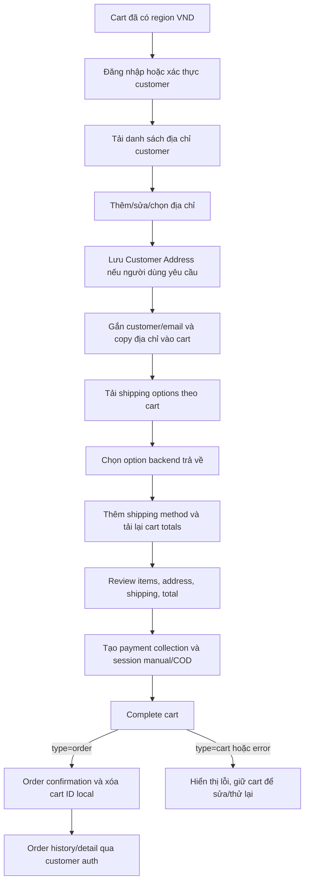

# Thiết kế — Address, Shipping, Checkout và Order

**Trạng thái:** checkout design và UI template đã được triển khai vào Flutter source; provider semantics và API runtime cần xác nhận trên DB demo Medusa 2.21.1.

## Template UI toàn app — Flagship Tech Boutique

- **Nền tảng:** Flutter Material 3; màu, chữ, input, card, dialog, button và navigation tập trung tại `apps/mobile/lib/theme/app_theme.dart`.
- **Tokens:** canvas xanh lạnh nhạt, surface trắng, chữ navy đậm, text phụ xám, viền nhẹ; navy dành cho hành động, màu giá và trạng thái có semantic riêng. Spacing theo nhịp 4/8 px; card bo 12–16 px; nút/vùng chạm tối thiểu 48 px.
- **Shell:** 4 điểm đến gốc Khám phá / Giỏ hàng / Đơn hàng / Tài khoản. Màn hình chi tiết, checkout, địa chỉ và auth mở như route tập trung, giữ cùng theme.
- **Catalog/detail:** tìm kiếm và hãng nằm trên lưới sản phẩm responsive; ảnh dùng đúng dữ liệu backend hoặc placeholder; detail giữ giá, phiên bản, tồn kho và thông số từ Medusa.
- **Cart/checkout:** thao tác số lượng/xóa và tổng server có phân cấp rõ; checkout đi theo địa chỉ → giao hàng → COD → sản phẩm/tổng, giá/tổng lấy lại sau khi chọn shipping.
- **Account/orders:** form, profile, địa chỉ, lịch sử, chi tiết và xác nhận dùng cùng header/card/state component; trạng thái đơn hàng dùng text cùng màu semantic.
- **Trust/accessibility:** icon-only action có tooltip; form không mất dữ liệu khi lỗi; không tạo rating/sale/bảo hành/ETA giả; nội dung cuộn và CTA đạt target chạm phù hợp.
- **Responsive/performance:** lưới lazy sliver 2–4 cột, layout mobile/NavigationBar đổi sang desktop/NavigationRail; không thêm package UI/state; formatter giá được cache và cart item được chuẩn hóa một lần mỗi build.

Phân rã triển khai và QA theo màn nằm trong [`ui-ux-plan.md`](ui-ux-plan.md). Layout smoke-check ở 320 px và desktop đã chạy; data/checkout live vẫn chờ backend, publishable key và provider demo.

## Quyết định kiến trúc

1. Dùng Customer, Cart, Fulfillment, Payment và Order native của Medusa; không thêm custom module hoặc migration cho luồng này.
2. `MedusaService` tiếp tục là HTTP boundary hiện có. Thêm DTO/model nhỏ có kiểu rõ ràng; widget không tự ghép endpoint hoặc tổng tiền.
3. Checkout orchestration ở Flutter, mỗi bước gọi API rồi cập nhật cart từ response mới nhất của Medusa.
4. Checkout yêu cầu đăng nhập trong MVP; cart có trước login được gắn với customer hiện tại.
5. COD là phương thức thanh toán demo. App chỉ chọn provider ID `pp_system` hoặc bắt đầu bằng `pp_system_` nếu endpoint theo region trả về; việc provider có được cấu hình và hoàn tất cart vẫn cần live check.
6. Billing address mặc định copy từ shipping; địa chỉ VN dùng text input cho tỉnh/thành và phường/xã trong MVP, không phụ thuộc danh mục hành chính bên ngoài.

## Luồng và quyền sở hữu dữ liệu

Customer Address và Cart Address là hai tài nguyên. Lưu address trong account không tự cập nhật cart; sau khi chọn/saved address, app phải gửi address fields vào cart update. Cart đang tồn tại trước login cũng cần gắn đúng customer/email trước checkout. Tất cả prices, shipping totals, discounts, stock và order result lấy từ response Medusa.

## Model và mapping địa chỉ

### Flutter form model hiện có

- `id` nếu là saved customer address; `address_name` tùy chọn.
- `first_name`, `last_name`, `phone` người nhận.
- `province_code` + tên tỉnh/thành; phường/xã; `address_1` địa chỉ nhà/đường; `address_2` phần bổ sung.
- `postal_code` tùy chọn; `country_code` luôn `vn`.
- Mã/nhãn phường và tỉnh có thể giữ trong `metadata` nếu Medusa address schema không có field chuẩn tương ứng. Không dùng metadata làm tiêu chí tính phí carrier nếu carrier chưa đọc được.

### Validation

- Bắt buộc: tên người nhận, số điện thoại, tỉnh/thành, phường/xã và địa chỉ chi tiết.
- Chuẩn hóa khoảng trắng; validate số điện thoại Việt Nam theo chính sách đã chốt, chấp nhận dạng `0…` hoặc `+84…`; lưu số đã nhập/chuẩn hóa nhất quán.
- Postal code tùy chọn; nếu nhập thì kiểm tra định dạng đã thống nhất.
- Không dựa vào regex frontend như thay thế validation của Medusa/provider; hiển thị lỗi server cạnh form hoặc summary.
- Khi địa chỉ thay đổi, bỏ lựa chọn shipping cũ và tải lại options.

### Mapping sang Medusa

| Form | Medusa customer/cart address | Ghi chú |
|---|---|---|
| Tên, họ | `first_name`, `last_name` | Dùng cùng address payload trên cart |
| Nhà/đường | `address_1` | Bắt buộc |
| Phường/xã hoặc phần còn lại | `address_2` + `metadata` nếu cần | Chốt cấu trúc sau khi chọn nguồn địa phương |
| Thành phố/tỉnh | `city` và `province` | `province` trong docs được mô tả theo ISO 3166-2; mapping VN cần xác minh |
| Số điện thoại | `phone` | Dùng số người nhận |
| Quốc gia | `country_code: "vn"` | Không lấy từ input tùy ý |
| Postal code | `postal_code` | Optional theo quyết định demo |

Billing mặc định copy từ shipping để giảm bước; cho phép nhập billing riêng chỉ khi có yêu cầu sản phẩm.

## API contract dự kiến

Các route dưới đây là Store API Medusa v2 theo tài liệu chính thức. Trước khi viết code, đối chiếu payload/fields với package `@medusajs/medusa` 2.21.1 đã cài và xác minh trên DB demo.

| Thao tác | Route dự kiến | Ghi chú |
|---|---|---|
| Lấy customer hiện tại | `GET /store/customers/me` | Bearer token và publishable key |
| Liệt kê saved addresses | `GET /store/customers/me/addresses` | Chỉ customer đang đăng nhập |
| Tạo address | `POST /store/customers/me/addresses` | Authenticated; server gắn customer hiện tại |
| Sửa/xóa address | `POST /store/customers/me/addresses/{address_id}` / `DELETE .../{address_id}` | Không cho client sửa address của customer khác |
| Gắn address/customer vào cart | `POST /store/carts/{cart_id}` | Bearer customer hiện tại; gửi customer/email và shipping/billing address; đọc cart response |
| Lấy shipping options | `GET /store/shipping-options?cart_id={cart_id}` | Xử lý danh sách rỗng; flat price lấy từ response |
| Tính giá shipping calculated | `POST /store/shipping-options/{option_id}/calculate` | Body `{cart_id, data}`; chỉ hiển thị amount backend tính |
| Thêm shipping method | `POST /store/carts/{cart_id}/shipping-methods` | `{ option_id, data: {} }`; rồi retrieve cart để dùng total mới |
| Liệt kê payment providers | `GET /store/payment-providers?region_id={region_id}` | Chọn provider ID backend thực sự trả về |
| Tạo payment collection | `POST /store/payment-collections` | Body gồm `cart_id` |
| Tạo payment session | `POST /store/payment-collections/{id}/payment-sessions` | Body gồm `provider_id`; provider có thể có payload riêng |
| Hoàn tất cart | `POST /store/carts/{cart_id}/complete` | Chỉ `type=order` mới đi đến màn success; `type=cart`/error ở lại checkout |
| List order | `GET /store/orders` | Customer JWT; Medusa lọc theo actor_id; có phân trang |
| Order detail UI | Dùng order trả về từ `GET /store/orders` hoặc complete cart | Medusa 2.21.1 route `GET /store/orders/{id}` mặc định không yêu cầu customer auth; app không gửi ID tùy ý lên route này |

Không gọi order API bằng ID do người dùng tự nhập. Dùng auth, publishable key và route Medusa; không tạo proxy custom nếu chưa chứng minh cần thiết.

## UI boundaries và state

- `AddressBookScreen`: loading, empty, selected, delete confirmation; điều hướng sang form.
- `AddressFormScreen`: create/edit, validation, submitting, server errors, save-and-return.
- `CheckoutScreen` (hoặc các bước riêng): step state địa chỉ → giao hàng → review; giữ cart mới nhất sau mỗi mutation.
- `ShippingOption` model parse label, description, amount/calculated amount, currency, option ID; UI không tính ship local.
- `Order` model chỉ parse response Medusa; `OrderSuccessScreen` nhận order object/ID sau success.
- `OrderHistoryScreen`/`OrderDetailScreen` gọi API có auth, có pagination/loading/error/empty.
- Xử lý token 401 bằng cơ chế existing `getCurrentCustomer`; khi session hết hạn điều hướng login và giữ cart để retry.
- Double-submit: disable nút khi request active, không gọi `complete` lần hai; nếu response không chắc chắn thì reload cart/orders trước khi retry.

## COD/manual semantics

COD/system provider là lựa chọn của demo. Installed Medusa 2.21.1 và tài liệu mô tả system provider theo ID `pp_system`; source lọc provider được backend trả về và chỉ gửi provider này vào payment-session flow. Điều đó **không chứng minh provider đã được cấu hình trên region demo**. Cần xác nhận danh sách provider, tạo session, complete cart trả order, và status được hiển thị đúng.

Copy UI nói “Đặt hàng”/“Thanh toán khi nhận hàng” và không nói “đã thanh toán” nếu payment chưa được thu/capture. Nếu không có manual provider khả dụng, dừng checkout demo và ghi blocker; không tự tạo fake success.

## Failure matrix

| Tình huống | Phản hồi app |
|---|---|
| Chưa có publishable key hoặc backend unavailable | Hướng dẫn cấu hình/thử lại; không vứt cart |
| 401/expired token | Xóa token theo service hiện có, yêu cầu đăng nhập lại |
| Customer không có address | Empty state + nút thêm address |
| Form invalid / Medusa validation error | Giữ nội dung, hiển thị field/form error |
| Địa chỉ đổi hoặc không có shipping option | Bỏ option cũ, yêu cầu sửa địa chỉ/chọn lại |
| Price/stock thay đổi | Hiển thị response backend, tải lại cart; không dùng giá cũ từ UI |
| Payment provider/session failure | Không complete; giữ cart và cho retry/chọn provider nếu có |
| Complete trả `cart` hoặc error | Không hiện success; cart/error state giữ lại |
| Order history 401/403 | Yêu cầu đăng nhập hoặc hiển thị lỗi; list API lọc theo customer auth |
| Order detail ID | Không gọi route detail không authenticated; chỉ hiển thị snapshot từ history/complete response |

## Nguồn API đã tra

- [Customer address flow](https://docs.medusajs.com/resources/storefront-development/checkout/address/index.html.md)
- [List customer addresses](https://docs.medusajs.com/api/store/customers/list-customers-addresses)
- [Create customer address](https://docs.medusajs.com/api/store/customers/create-address)
- [Update cart](https://docs.medusajs.com/api/store/carts/update-a-cart)
- [List shipping options for cart](https://docs.medusajs.com/api/store/shipping-options/list-shipping-options-for-cart)
- [Shipping checkout flow](https://docs.medusajs.com/resources/storefront-development/checkout/shipping)
- [Payment collection/session](https://docs.medusajs.com/api/store/payment-collections)
- [Payment checkout flow](https://docs.medusajs.com/resources/storefront-development/checkout/payment)
- [Complete cart](https://docs.medusajs.com/resources/storefront-development/checkout/complete-cart)
- [List customer orders](https://docs.medusajs.com/api/store/orders/list-orders)
