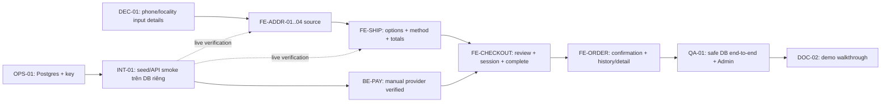

# Kế hoạch triển khai — Address → Shipping → COD Checkout → Orders

**Trạng thái:** source, local format/analyze/tests/Web build đã pass; GitHub run, API/runtime và E2E gates còn mở.
**Thứ tự ưu tiên:** xử lý môi trường demo trước các kiểm chứng live; phát triển address → shipping → payment/complete → order theo dependency.

## Tổng quan

Flutter source hiện có catalog, cart, auth, địa chỉ, shipping, COD checkout, confirmation, order history và detail. Automated checks và Web build chạy local đã pass; còn chờ workflow GitHub chạy lần đầu, provider/runtime confirmation và E2E trên database demo riêng. Luồng dùng Medusa native endpoints, không tạo commerce schema riêng.

## Quyết định phạm vi MVP

- Checkout yêu cầu đăng nhập; guest checkout ngoài phạm vi MVP.
- COD là phương thức thanh toán demo. App lọc system provider (`pp_system` / `pp_system_*`) từ danh sách Medusa theo region; cấu hình thực tế và complete flow vẫn cần xác minh trên DB demo.
- Address lưu bằng Customer Address API; lựa chọn được copy vào cart address.
- Billing mặc định bằng shipping.
- Giá shipping do Medusa trả; giá seed 30.000/50.000 VND còn là demo.
- Form MVP dùng text input có validation cho địa phương VN; danh mục dropdown chỉ thêm khi chọn được nguồn dữ liệu.
- DEC-01 đã chốt: nhận `0` + 9 số hoặc `+84` + 9 số, chuẩn hóa lưu `+84`; địa phương dùng text input.

## Dependency graph

Address model, API service, form/list, shipping UI/service, runbook maintenance và stale-roadmap cleanup có thể triển khai bằng unit/mocked checks trong lúc database blocker còn mở. Chỉ live API/provider acceptance và E2E cần safe DB, key và provider.

## Các phase và checkpoints

### Phase 0 — Contract và môi trường

- Chốt các chi tiết nhập/chuẩn hóa địa chỉ còn mở trong `tasks/spec.md`.
- Tạo/nhận một PostgreSQL database dùng riêng cho demo, sửa kết nối pool theo cấu hình hợp lệ.
- Chạy backend; xác nhận health/Admin và publishable key đúng sales channel.
- Chỉ sau đó chạy seed trên database này; xác minh seed rerun và Store API VN/VND/search/shipping.

**Checkpoint A:** backend nghe cổng 9000; key tải được catalog; data thuộc channel/region demo; chưa có order side effect.

### Phase 1 — Customer address (source implemented)

- Model/validator và mapping DTO.
- Customer address list/create/update/delete qua authenticated service.
- Form/list screens.
- Attach customer/email, shipping/billing address vào cart; xử lý cart được tạo trước login.

**Checkpoint B:** code đã thực hiện; saved address/cart response và thay đổi địa chỉ cần live API xác minh.

### Phase 2 — Shipping (source implemented)

- List options theo cart đã có địa chỉ.
- Hiển thị label và price/currency từ backend; empty/error/retry.
- Thêm option vào cart, tải lại cart totals.

**Checkpoint C:** code cập nhật cart và tải lại total; cần so sánh response thật trên DB demo.

### Phase 3 — Payment/checkout (source implemented; provider gate open)

- Verify provider theo region; nếu manual/COD không khả dụng, ghi blocker trước khi đổi payment scope.
- Tạo payment collection/session theo flow Medusa.
- Review items/address/shipping/total từ cart mới nhất.
- Complete cart, phân nhánh theo response `order` vs `cart`/error, chống double-submit.

**Checkpoint D:** complete trả order trên safe DB; app chỉ show success cho order response.

### Phase 4 — Order (source implemented; live ownership/order gate open)

- Parse/store order response cho màn confirmation.
- Clear local cart ID sau order success.
- Lịch sử phân trang qua customer-auth API; detail UI dùng order snapshot từ authenticated history/complete response. Medusa 2.21.1 detail-by-ID route không authenticated nên app không gọi route đó.

**Checkpoint E:** source đã có; order trong Admin/history và kết quả hiển thị cần live xác minh.

### Phase 5 — Hardening và demo

- Chạy unit/service/widget checks; manual E2E trên DB riêng. Chưa tạo hoặc chạy test trong turn implementation này.
- Chuẩn hóa errors/retries/empty/expired auth/stock/payment failures.
- Xác minh dữ liệu demo, shipping rates, ảnh sản phẩm và copy trạng thái thanh toán.
- Hoàn thiện `DEMO_GUIDE.md`, mobile README và roadmap theo evidence mới nhất; live walkthrough chỉ sau INT-01.

**Checkpoint F:** người khác có thể chạy demo theo tài liệu, không cần key/URL machine-only trong Git.

## Thứ tự task

Task IDs, acceptance criteria, file scope và verify command nằm trong [`tasks/todo.md`](todo.md). Critical path:

Hai nhánh có thể chạy song song: source `DEC-01 → FE-ADDR-01..04 → FE-SHIP-01..02`; runtime `OPS-01 → INT-01`. Sau đó gộp tại `BE-PAY-01 → FE-CHECKOUT-01..02 → FE-ORDER-01..02 → QA-01/02 → DOC-02` để xác minh provider và E2E.

`DOC-01` và `FE-ADDR-01` có thể bắt đầu trước DB. `INT-01`, `BE-PAY-01`, checkout/order integration không được đánh dấu hoàn tất bằng mocks.

## Rủi ro và xử lý

| Rủi ro | Tác động | Cách xử lý |
|---|---|---|
| PostgreSQL hiện timeout trong Medusa | Không thể verify seed hoặc API | Chỉ dùng DB demo riêng; không seed/reset database chưa xác minh |
| Publishable key chưa được inject vào app | Catalog không tải | Lấy key từ Admin sau khi channel linkage được xác nhận; truyền qua dart-define |
| Docs mới hơn Medusa 2.21.1 | Request shape/provider semantics có thể khác | Đối chiếu package source và API response của installed version trước FE service |
| Không có system provider theo region | Không có COD demo | UI chặn checkout; xác minh provider list trước, không giả lập payment |
| Customer address khác cart address | Địa chỉ đã lưu nhưng checkout sai | Save customer resource và update cart resource thành hai request riêng |
| Admin đổi giá/tồn kho sau khi UI tải | Cart/order có thể khác detail | Re-fetch server cart; xử lý completion errors theo response Medusa |
| Local seed có số liệu demo | Demo gây hiểu nhầm là dữ liệu thật | Label demo; xác minh/đổi price, stock, warranty, image, shipping trước demo |
| Android Gradle Kotlin incremental cache lỗi khi build | Máy hiện tại không chạy `flutter run` thường | Kiểm tra project-level workaround; runbook ghi workaround đã build APK nhưng phải verify chạy hot-reload |

## Giới hạn plan

- Không bao gồm provider online, tích hợp carrier, guest order tracking, promotions/wishlist hoặc mở rộng Next.js storefront.
- Không thêm migrations/module hoặc dependencies nếu native API và packages hiện có đáp ứng.
- Mọi DB-facing tasks bị chặn đến khi có safe target; không dùng database người dùng theo suy đoán.
